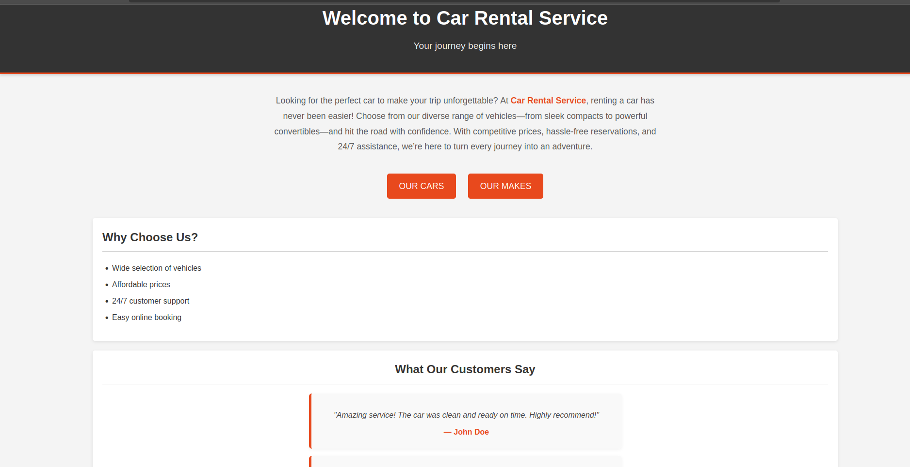
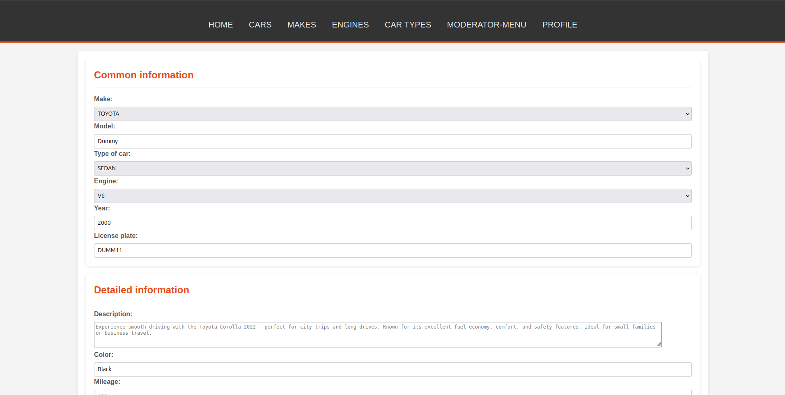
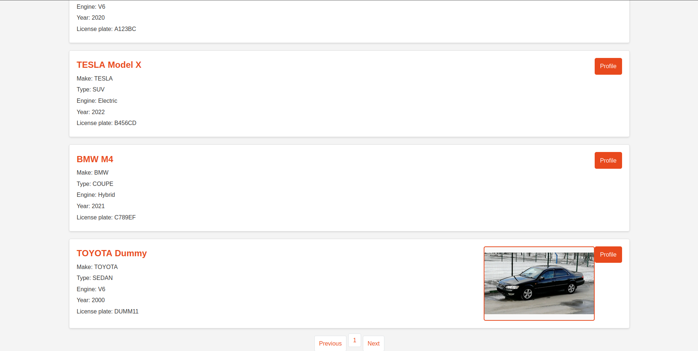
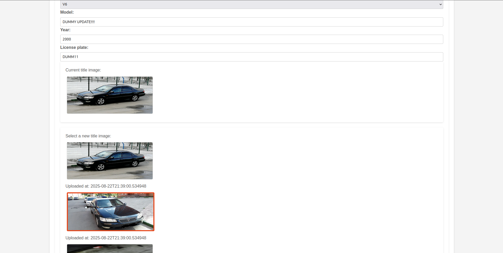
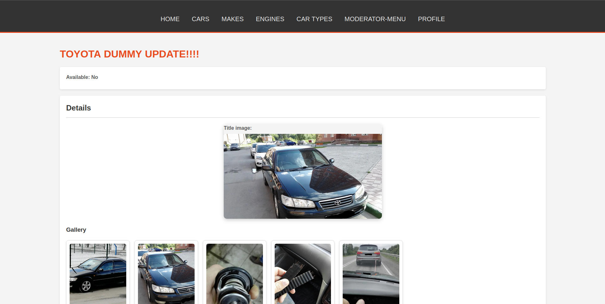
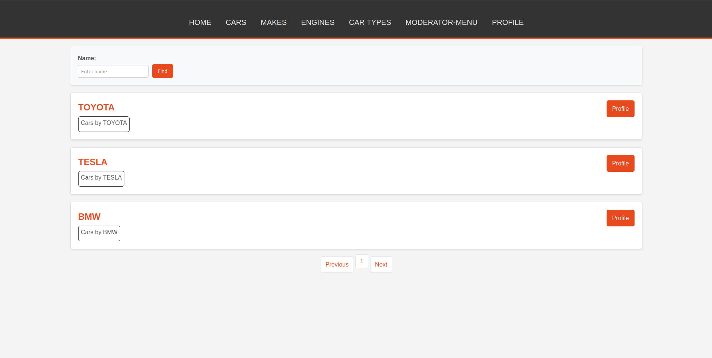
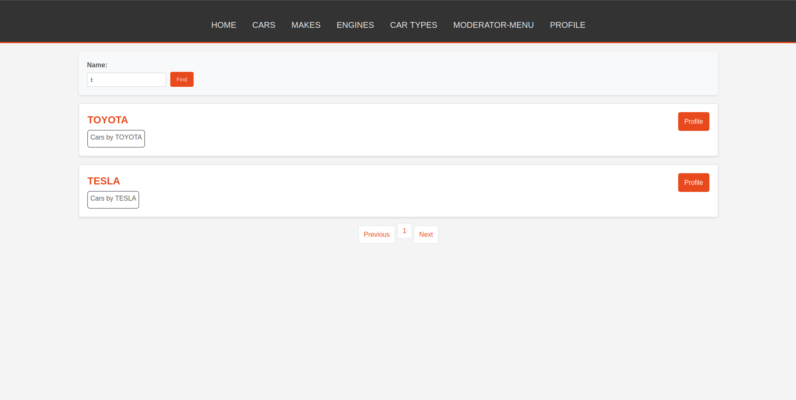

# Car Rental Service

**Car Rental Service** — современная версия моего учебного веб-приложения для аренды автомобилей.  
В отличие от **[Legacy-версии](https://github.com/re1kur/car-rental-service-legacy)**, здесь используется Spring Boot и другие современные технологии, что позволяет реализовать более гибкую архитектуру, расширенные возможности и полноценную работу с безопасностью.

---

## 🎯 Цель проекта

- Учебный pet-проект, созданный для демонстрации навыков в области backend-разработки.  
- Проект отражает переход от legacy-технологий (Servlets, JSP) к современным решениям (Spring Boot, Keycloak, S3-хранилища, Docker).  

---

## 👥 Целевая аудитория

- HR и рекрутеры, чтобы быстро оценить стек технологий и навыки.  
- Разработчики, которые хотят посмотреть пример CRUD-приложения с безопасностью, загрузкой файлов и интеграцией с внешними сервисами.  

---

## 🔑 Основной функционал

- **CRUD-операции** для компаний, автомобилей, аренды, двигателей, типов автомобилей.  
- **Загрузка и хранение файлов** (например, аватарки марок или автомобилей) в S3-совместимом хранилище MinIO.  
- **Аутентификация и авторизация** через Keycloak (OAuth2).  
- **Метаданные объектов** (например, дата загрузки).  
- **REST API** с документацией в Swagger (OpenAPI).  
- **Веб-интерфейс** на Thymeleaf.  
- **Валидация данных**, обработка ошибок, логирование.  

---

## 🛠️ Технологии

- **Backend:** Spring Boot, Spring Security, REST API, MVC (монолит)  
- **UI:** Thymeleaf  
- **БД:** PostgreSQL (отдельно для приложения и для Keycloak)  
- **ORM и миграции:** JPA/Hibernate, Liquibase  
- **Файлы и хранилище:** MinIO (S3-совместимое)  
- **Аутентификация и авторизация:** Keycloak (OAuth2)  
- **Тестирование:** JUnit, Mockito  
- **Контейнеризация:** Docker, Docker Compose  
- **Документация API:** Swagger + OpenAPI  
- **Сборка:** Maven  

---

## 📂 Архитектура и особенности

- Монолитная архитектура с разделением на слои (Controller → Service → Repository).  
- Keycloak полностью отвечает за управление пользователями, ролями и правами доступа.  
- Multipart-файлы обрабатываются и сохраняются в MinIO.  
- Liquibase управляет схемой базы данных.  
- Логирование, централизованная обработка ошибок, валидация DTO.  

---

## 🚀 Установка и запуск

1. **Запустить инфраструктуру через Docker Compose** (PostgreSQL, Keycloak, MinIO и другие сервисы):  
   ```bash
   docker-compose up --build
   ```
   > **Примечание:** Подождите, пока keycloak полностью инициализируется и импортирует realms.
2. **Запустить локально приложение** через Maven:

   **Для Linux/macOS:**

   ```bash
   ./mvnw spring-boot:run -Dspring-boot.run.profiles=local
   ```

   Если скрипт `mvnw` не имеет прав на выполнение, добавьте:

   ```bash
   chmod +x mvnw
   ```

   **Для Windows:**

   ```cmd
   mvnw.cmd spring-boot:run -Dspring-boot.run.profiles=local
   ```
3. **Конфигурации и переменные:**

    * Проект уже настроен для запуска «из коробки».
    * При необходимости можно изменить параметры в `application-local.yml`, `docker-compose.yml` и их `.env` файлах (например, порты, креды для БД или MinIO).

---

## 📌 Статус проекта

* Учебный **pet-проект**.
* Демонстрирует навыки работы со Spring Boot, безопасностью и внешними сервисами.
* Не предназначен для production-использования.
* Планы развития: пока не определены.

---

## 📸 Скриншоты

- **Главная страница** (`/`)  
  

- **Создание автомобиля — шаг 1**  
  

- **Создание автомобиля — шаг 2**  
  

- **Список автомобилей** (включая только что созданный автомобиль)  
  

- **Редактирование автомобиля** (форма изменения данных)  
  

- **Обновлённый автомобиль** (новое название и титульное фото)  
  

- **Список марок автомобилей**  
  

- **Поиск по маркам автомобилей** (поиск по названию; аналогично можно искать машины по названию, году или марке)  
  

---

## 📚 Дополнительно

* Документация API доступна через **Swagger (OpenAPI)**.
* Контейнеризация через Docker Compose и Maven Wrapper 'mvnw' позволяет легко поднять инфраструктуру сервиса и приложение.
* Возможность расширения (например, деплой в облако или разделение на микросервисы).

---